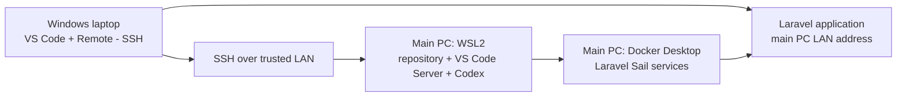

# Remote Development

## Purpose

Document the optional local-network setup for developing DancePro V2 from a
second Windows laptop while the application, source code and development
services remain on the main development PC.

For the shortest day-to-day instructions, see the
[Remote Development Cheat Sheet](Remote-Development-Cheat-Sheet.md).

## Architecture

The main Windows PC remains the development host. WSL2 contains the repository
and Linux development environment, while Docker Desktop and Laravel Sail run on
that PC. The laptop is only a remote client and does not need WSL, Docker, PHP,
Composer, Node.js, a database or another copy of the repository.



Files opened in VS Code and commands entered in its integrated terminal operate
inside WSL on the main PC. Codex should also use this remote workspace, not a
local copy on the laptop.

## Initial Setup

### Enable WSL Mirrored Networking

On the main PC, add the following to the Windows user's `.wslconfig` file:

```ini
[wsl2]
networkingMode=mirrored
```

Apply the change from Windows PowerShell:

```powershell
wsl --shutdown
```

Reopen WSL afterward. Docker Desktop may also need to be completely exited and
restarted whenever WSL or its networking mode is restarted.

Mirrored networking makes services in WSL reachable through the main PC's LAN
address. Do not rely on WSL's internal `172.x.x.x` address for this setup. Find
the main PC's current LAN address with `ipconfig` in Windows PowerShell and use
the appropriate IPv4 address for the trusted local network.

### Allow Trusted Local-Network Traffic

The following command was run from elevated Windows PowerShell to permit
inbound traffic to WSL when mirrored networking is enabled:

```powershell
Set-NetFirewallHyperVVMSetting -Name '{40E0AC32-46A5-438A-A0B2-2B479E8F2E90}' -DefaultInboundAction Allow
```

This changes the default inbound firewall behaviour for the WSL Hyper-V virtual
machine. Use it only on a trusted development PC and trusted network, after
considering the services exposed by WSL. It is not a suitable general-purpose
production security configuration. Prefer a narrower firewall policy if this
environment later needs exposure beyond the trusted LAN.

### Configure SSH in WSL

Install OpenSSH Server in WSL if it is not already present, then confirm and
start it with:

```bash
which sshd
sudo service ssh start
sudo service ssh status
sudo ss -tlnp | grep :22
hostname -I
```

From the laptop, test the connection before configuring VS Code:

```bash
ssh <wsl-user>@<development-pc-lan-ip>
```

Replace `<wsl-user>` with the username shown by `whoami` inside WSL. Replace
`<development-pc-lan-ip>` with the main PC's LAN IPv4 address from `ipconfig`.
Do not store passwords, private keys or other credentials in project
documentation.

WSL must be running and `sshd` must be running for this connection to succeed.
Starting the main PC does not by itself guarantee that both are available.

### Configure VS Code on the Laptop

1. Install Visual Studio Code on the laptop.
2. Install Microsoft's **Remote - SSH** extension.
3. Run **Remote-SSH: Connect to Host** from the Command Palette.
4. Connect to `<wsl-user>@<development-pc-lan-ip>` and select **Linux** when
   prompted for the remote platform.
5. Open the DancePro V2 project directory from the remote WSL filesystem.

VS Code installs its Server component in the remote WSL environment. Install or
enable project-aware extensions for the SSH remote when VS Code indicates they
are only installed locally. Enable Codex in the remote environment and ensure
it is operating on the WSL project directory.

Verify the active workspace from the integrated terminal:

```bash
pwd
git status
docker ps
./vendor/bin/sail ps
```

`pwd` should show the WSL project path, and `git status` should describe the
main repository rather than a laptop-side copy.

## Normal Operation

Before connecting, ensure the main PC is on, Docker Desktop is running, WSL is
open and the SSH service is running. Connect from VS Code and open the remote
project folder.

Start Sail from the project root:

```bash
./vendor/bin/sail up -d
```

Although the command is entered on the laptop, it runs inside WSL and controls
Docker on the main PC. Because Sail runs detached, closing VS Code or the SSH
connection does not stop its containers.

Useful lifecycle commands are:

```bash
./vendor/bin/sail ps
./vendor/bin/sail logs
./vendor/bin/sail stop
./vendor/bin/sail down
```

Use `stop` when the containers should be stopped but retained. Use `down` when
the Sail application containers and network should be removed. Neither command
should normally remove the project's persistent database volume.

Open the application on the laptop using the main PC's LAN address and the port
configured for Sail, for example:

```text
http://<development-pc-lan-ip>:<application-port>
```

The application remains hosted by Sail on the main PC. Browser access also
depends on the relevant Windows and Hyper-V firewall rules permitting that
port on the trusted network.

To disconnect safely, close the remote VS Code window or use **Remote: Close
Remote Connection**. Leave Sail running if it will be needed later, or stop it
explicitly before disconnecting.

## Troubleshooting

Work through the layers in order so an SSH, Docker or Laravel problem is not
mistaken for another kind of failure.

### 1. Test Plain SSH

From the laptop:

```bash
ssh <wsl-user>@<development-pc-lan-ip>
```

If this times out, troubleshoot WSL, SSH and firewall/network reachability
before troubleshooting VS Code. A timeout encountered during initial setup was
caused by WSL—and therefore `sshd`—no longer running.

### 2. Confirm WSL and SSH

Open WSL on the main PC, then run:

```bash
sudo service ssh status
sudo service ssh start
sudo ss -tlnp | grep :22
```

The final command should show a process listening on port 22. If plain SSH now
works, reconnect with VS Code Remote - SSH.

### 3. Confirm Docker Before Sail

In WSL, run:

```bash
docker ps
```

If this fails, the problem is between WSL and Docker Desktop rather than in
Laravel or Sail. After WSL networking changes, the recovery used during setup
was:

1. Run `wsl --shutdown` in Windows PowerShell.
2. Completely exit and restart Docker Desktop.
3. Reopen WSL.
4. Run `docker ps` again.

Only continue to Sail once Docker responds normally.

### 4. Confirm Sail and Laravel

From the project root:

```bash
./vendor/bin/sail ps
./vendor/bin/sail up -d
./vendor/bin/sail logs
```

If Docker works but Sail does not, inspect the Sail container status and logs.
If Sail works but the browser cannot reach the application, confirm the main
PC's current LAN address, the configured application port and the firewall
rules for that port.

## Security Notes

- Keep this setup restricted to a trusted local network.
- Do not expose SSH or Sail directly to the public internet.
- Do not place passwords, `.env` contents, private keys or credentials in the
  repository or VS Code SSH host entries.
- Reassess the permissive Hyper-V inbound rule if the PC is used on untrusted
  networks or the networking requirements change.

## Related Documentation

- [Development Environment](Development-Environment.md)
- [Remote Development Cheat Sheet](Remote-Development-Cheat-Sheet.md)
- [Security](Security.md)
- [Testing](Testing.md)

